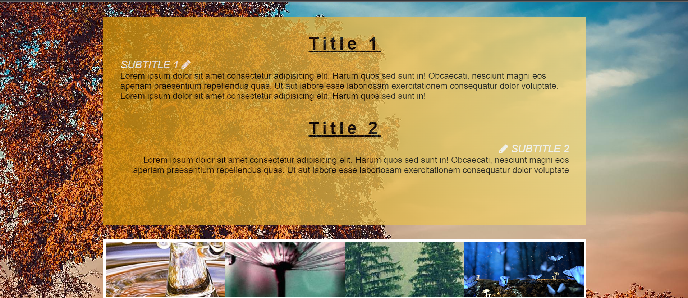

# Background Image Exercise

### Instructions:

We use our webpage from the last time and extend it with some background images. You will find the starter kit in this folder. 

In the end your page should look like the reference picture in the img folder. Try to find the right position and size of the background pictures by trying out the learned properties.  

Each of the galerie pictures at the bottom uses a different position or a different size. 

